<head><title>PARCIALES</title></head>
<body>
<body bgcolor="aqua ">

CENTRO DE ESTUDIOS  TECNOLOGICO INDUSTRIAL Y DE SERVICIOS NO.79 COATZACOALCOS, VERACRUZ 

 

ESPECIALIDAD:OFIMATICA

 

MOD 1 SUB-1

 

INSTALA Y CONFIGURA EQUIPOS DE COMPUTO Y PERIFERICOS 

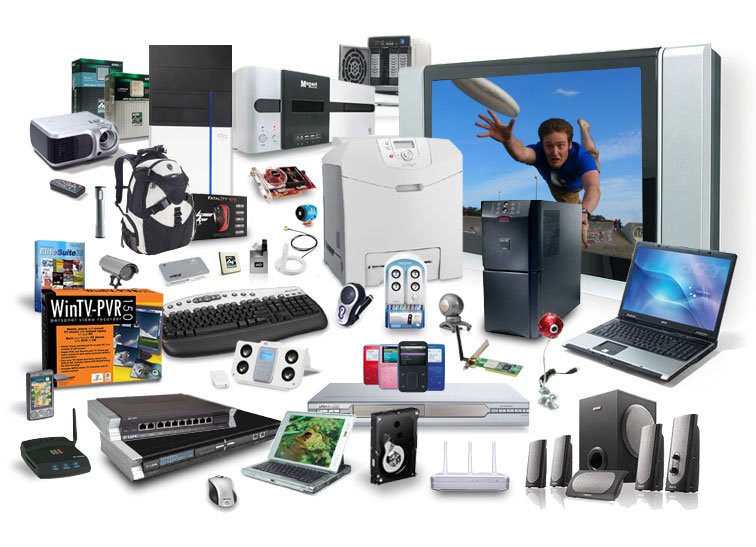
<tr>
 

ALUMNO:MORALES OLAN MELLANY ALEXA

 

GRUPO: 2 "N" 

 

FECHA:26/JUNIO/2024 

<h1>  

PARCIAL UNO 

 

 COATZACOALCOS    ESPECIALIDAD OFIMATICA

 

 

MOD I SUB I OFIMATICA  BLOQUE I: COMPONENTES BASICOS DE UNA COMPUTADORA   

 
 

ALUMNO:  GRUPO: 

 
 

ACTIVIDAD 1 

  

TEMA:EVALUACION DIANOSTICA 

 
 

ESCRIBE EL NOMBRE DEL DISPOSITIVO DEBAJO DE LA IMAGEN  

<body>
<table width="60%" border="1" cell padding="1" cellspacing="55" bordercolor "blue">
<tr>
<td> </  </td>
<td>  </ </td>
<td>  </  </td>
<td>  </  </td>
</tr>

<tr>
<td> 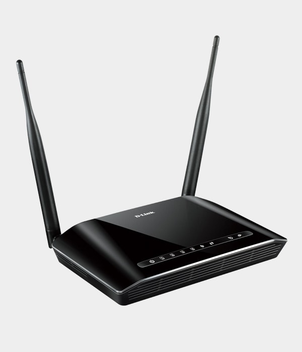</  </td>
<td>  </ </td>
<td>  </  </td>
<td>  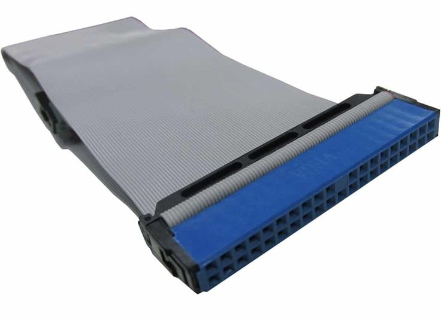</  </td>
</tr>

<tr>
<td> 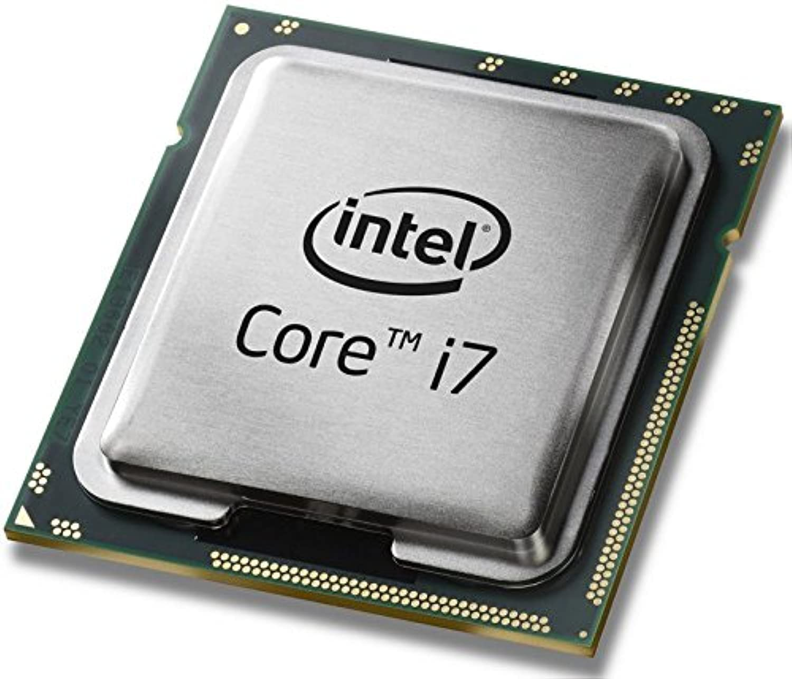</  </td>
<td>  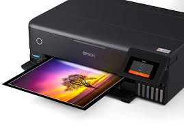</ </td>
<td>  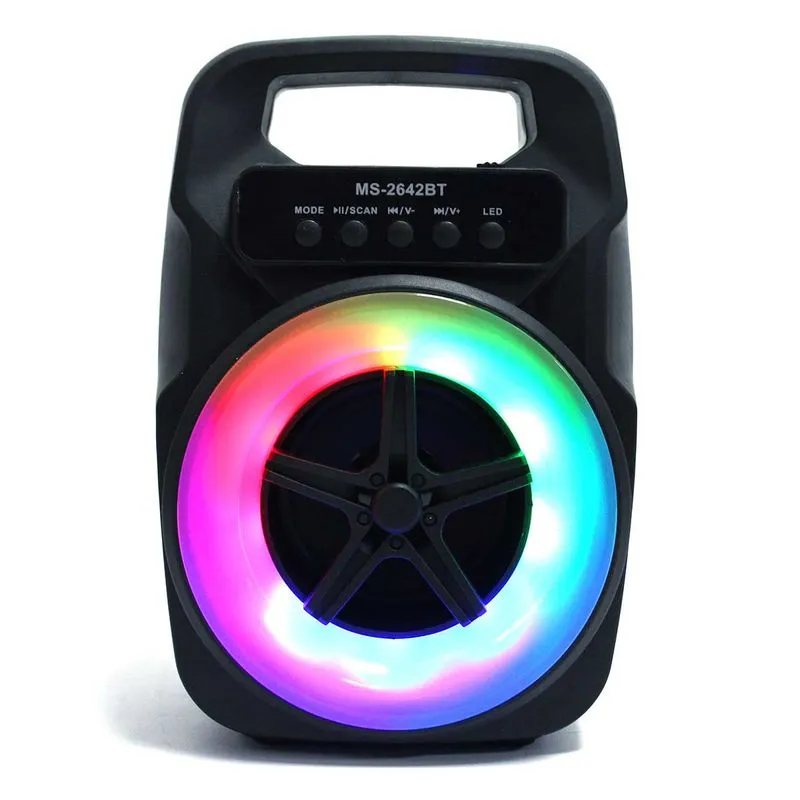</  </td>
<td>  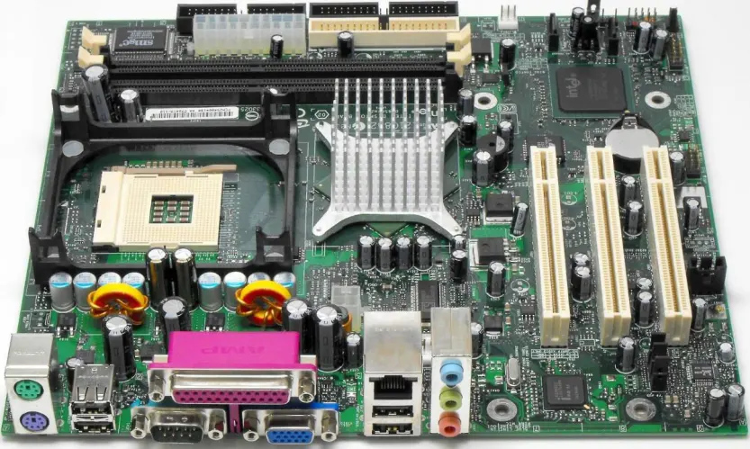</  </td>
</tr>

<tr>
<td> 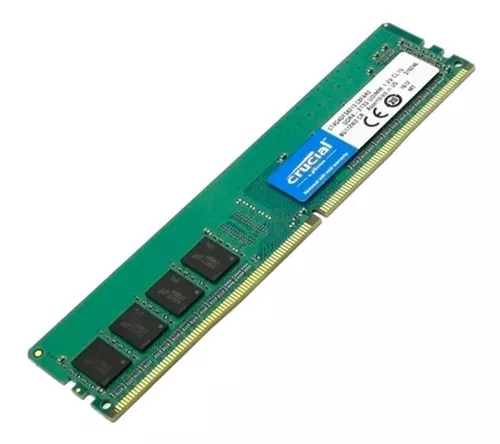</  </td>
<td>  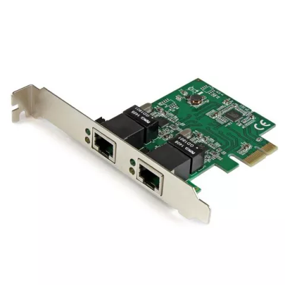</ </td>
<td>  </  </td>
<td>  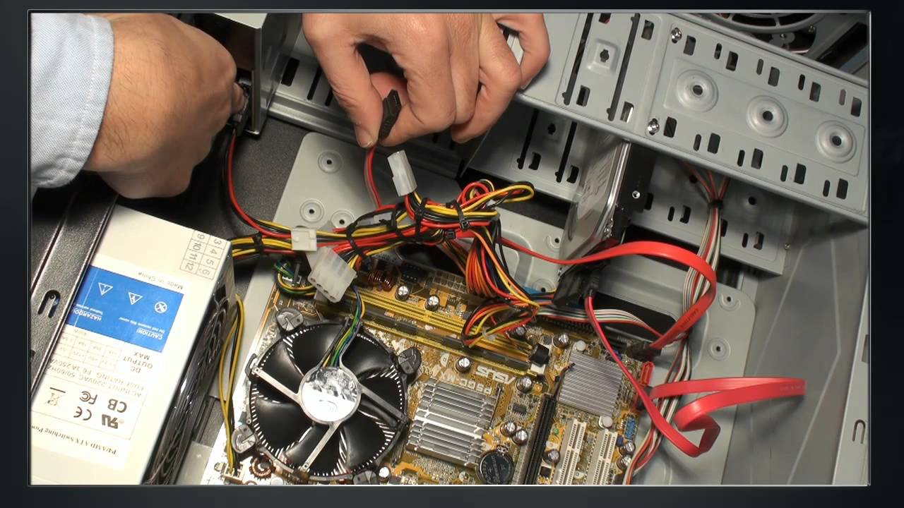</  </td>
</tr>

<tr>
<td> </  </td>
<td>  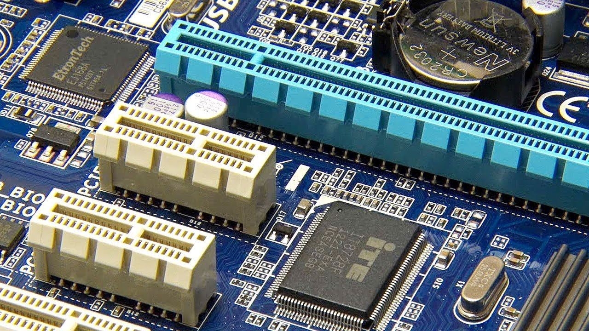</ </td>
<td>  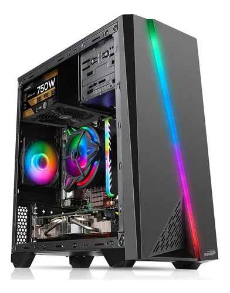</  </td>
</tr>
</table>

  

PARTE 2

 

INSTRUCCION: LEE DETALLADAMENTE CADA CUESTION Y SUBRAYA LA RESPUESTA QUE CONSIDERES CORRECTA 

 

1.SE DEFINE COMO EL CONJUNTO DE PARTES FISICAS DE UNA COMPUTADORA   

A)SOFTWARE B)HARDWARE C)MEMORIAS D)PROGRAMAS

 

2.SE DEFINE COMO EL CONJUNTO DE PROGRAMAS QUE HACEN FUNCIONAR AUN EQUIPO DE COMPUTO   

A)SOFTWARE B)HARDWARE C)MEMORIAS D)TARJETA MADRE 

 

3.PRINCIPAL DISPOSITIVO DE ALMACENAMIENTO DE INFORMACION DE UNA COMPUTADORA   

A)RAM B)DISCO DURO C)ROM D)MEMORIA USB 

 

4.DISPOSITIVO USADO PARA TENER CONEXION DE INTERNET DE MODO ALAMBRICO  O INALAMBRICO   

A)TARJETA RED B)MODEM C)WIFI D)REPETIDOR 

 

5.ES EL PROGRAMA MAS IMPORTANTE DE UNA COMPUTADORA Y/O DISPOSITIVO MOVIL YA QUE PERMITE QUE LOS USUARIOS SE COMUNIQUEN CON ELLA Y QUE LOS DEMAS PROGRAMAS O APLICACIONES QUE SE INSTALEN FUNCIONEN DE MANERA CORRECTA  

A)ANTIVIRUS B)HOJAS F C)WIFI D)REPETIDOR 

 

6.SE TRATA DE UN PUERTO QUE PERMITE CONECTAR EL MONITOR CON LA TARJETA MADRE DE LA PC A FIN DE LA MISMA PUEDA MOSTRAREN PANTALLA TODOS LO QUE SUCEDEEN LA COMPUTADORA  

A)USB B)VGA F C)RJ45 D)ZOCALO 

 

7.PLACA O TARJETA DONDE ESTAN CONECTADOS TODOS LOS DISPOSITIVOS QUE COMPONEN UNA COMPUTADORA 

A)MEM RAM B)TARJETA MADRE  C)CPU D)FUENTE DE ENERGIA 

 

8.MEMORIA DE ACCESO ALEATORIO QUE SE ENCARGA DE GUARDAR LA INFORMACION DE LA COMPUTADORA MIENTRAS ESTE ENCENDIDA CUANDO SE APAGA EL EQUIPO LA INFORMACION SE PIERDE 

A)MEM B)TARJETA MADRE  C)CPU D)FUENTE DE ENERGIA  

 

9.DISPOSITIVO ELECTRONICO QUE SE ENCARGA DE REGULAR Y DETERMINAR LA FORMA EN COMO SE MOSTRARAN LASA IMAGENES Y TEXTO QUE SE OBSERVA EN EL MONITOR DE LA COMPUTADORA

A)TARJ. DE VIDEO B)TARJ. DE SONIDO   C)TARJ. DE RED D)TARJ.MADRE 

 

10.ES UN CIRCUITO QUE SE LECONOCE COMO LA UNIDAD CENTRAL DE PROCESO , TAMBIEN SE LE CONOCE COMO EL CEREBRO DE UNA COMPUTADORA M Y ES DONDE SE PROCESAN

A)MEM RAM  B)DISCO DURO  C)CPU D)TARJETA MADRE 

  

ACTIVIDAD 2

 

GENERACIONES DE COMPUTADORAS  

<body>
<table width="60%" border="2" cell padding="20" cellspacing="10"width="75%" bgcolor="yellow"  bordercolor "blue">
<tr >
<td>  GENERACIONES  </td>
<td>  PERIODO  </td>
<td>  ENTRADA</td>
<td>  PROCESOS  </td>
<td> SALIDA </td>
<td> CARACTERISTICAS </td>

</tr>

<tr>
<td>  1 GENERACION </td>
<td> -   </td>
<td>-   </td>
<td>  -  </td>
<td> - </td>
<td>- </td>

</tr>

<tr>
<td>  2 GENERACION </td>
<td> -   </td>
<td>-  </td>
<td>  -  </td>
<td> - </td>
<td>- </td>

</tr>

<tr>
<td>  3 GENERACION </td>
<td> -   </td>
<td>-  </td>
<td>  -  </td>
<td> - </td>
<td>- </td>

</tr>

<tr>
<td>  4 GENERACION </td>
<td> -   </td>
<td>-  </td>
<td>  -  </td>
<td> - </td>
<td>- </td>

</tr>

<tr>
<td>  5 GENERACION </td>
<td> -   </td>
<td>-  </td>
<td>  -  </td>
<td> - </td>
<td>- </td>

</tr>

<tr>
<td>  6 GENERACION </td>
<td> -   </td>
<td>-  </td>
<td>  -  </td>
<td> - </td>
<td>- </td>
</tr>

</table>

  

ACTIVIDAD 3

 

RELACIONA LAS COLUMMAS DE ACUERDO CON LA GENERACION Y SUS CARACTERISTICAS ESCRIBIENDO LA LETRA QUE CORRESPONDE DENTRO DEL PARENTESIS.  

<body>
<table width="60%" border="1" cell padding="0" cellspacing="30" width="75%" bgcolor="7349A2" bordercolor "blue">
<tr>
<td>  PRIMERA GENERACION  </td>
<td>  (0) </td>
<td> A)Se implementaron los transistores lo cual
hizo que el tamaño de la computadora
disminuyera, asi como su consumo de
electricidad y la emisión de calor, las
compañías aéreas las comenzaron a
utilizar. </td>
</tr>

<tr>
<td>  SEGUNDA  GENERACION  </td>
<td> (0)  </td>
<td> B)Son como las conoces actualmente y se les
 conoce también como "dispositivos" comparte la tecnología de la generación
anterior, pero con grandes mejoras en su
desempeño y adaptabilidad con la
conectividad y la Internet. </td>
</tr>

<tr>
<td>  TERCERA   GENERACION  </td>
<td> (0)  </td>
<td> C)La comunicación con la computadora fue en
un lenguaje más cotidiano aplicando
inteligencia artificial (imitando al cerebro
humano) a través de la interfaz grafica que
interactuaba con un ratón y no a través de
lenguajes de control especializados.</td>
</tr>

<tr>
<td>  CUARTA   GENERACION  </td>
<td> (0)  </td>
<td> D)Pesaban varias toneladas y eran del tamaño
de hasta una habitación, producían
demasiado calor debido a su alto consumo
de electricidad, eran utilizadas para
investigaciones cientificas, militares y
nucleares, existían pocas en el mundo.</td>
</tr>

<tr>
<td>  QUINTA  GENERACION  </td>
<td> (0)  </td>
<td> E)Comenzaron a realizar análisis numéricos.
administración o procesamiento de archivos
al mismo tiempo (multiprogramación), la
interacción del usuario con los procesos de
la computadora se facilitó debido al
surgimiento del software y de los sistemas
operativos.</td>
</tr>

<tr>
<td>  SEXTA  GENERACION  </td>
<td>  (0) </td>
<td> F)Las computadoras se vuelven visualmente
atractivas y de fácil instalación, aumentó su
capacidad de procesamiento de información
una velocidad impresionante, se volvieron
demasiado pequeñas y baratas se les llamo
PC (computadora personal), se extendió al
uso doméstico.</td>
</tr>

</table>

  

PARTE 2

 

Lee las sigulontes aseveraciones sobre las funciones que realiza la computadora y
determina si es correcta o no. Escribe en el parentesis "V" si es verdadera y 'F si es falsa.  

<ol>

     <li>Para que proceses ta información (texto, números, sonidos, video,
imágenes, etc.) en una computadora la debes ingresar por medio de la
impresora, el monitor, bocinas.( - )</li> 
     <li>Puedes organizar tu información digital acorde a tus necesidades para
acceder a ella rápidamente.( - )</li> 
     <li>La computadora permite recibir instrueciones y datos (salida) para
realizar operaciones (entrada) ý ganerar un resultado (procesamiento).( - )</li> 
     <li>Puedes guardar en poço espacio fisico una enorme cantidad de tu
información digital como jmágenes,música, videos, documentos, etc.( - )</li> 
<li> Puedes compartir tu informaçión oigital a través de memorias USB, CD.
bluetooth o por internet.( - )</li> 
</ol>

  

PARTE 3

 

Marca con una "X" las casillas de la generación que corresponde a la tecnología que utilizaba para la entrada de datos, procesamiento y almacenamiento.  

<table width="60%" border="10" cell padding="3" cellspacing="2"  width="75%" bgcolor="F5CF20"  bordercolor "blue">
<tr>
<td>  TECNOLOGIA </td>
<td>  1.</td>
<td>  2. </td>
<td>  3. </td>
<td> 4.  </td>
<td> 5. </td>

</tr>

<tr>
<td>  Cilindro o Tambor magnético</td>
<td>  .</td>
<td>  . </td>
<td>  . </td>
<td> .  </td>
<td> . </td>

</tr>

<tr>
<td>  Circuito integrado (Chip]</td>
<td>  .</td>
<td>  . </td>
<td>  . </td>
<td> .  </td>
<td> . </td>

</tr>

<tr>
<td>  Disco Óptico (CD)</td>
<td>  .</td>
<td>  . </td>
<td>  . </td>
<td> .  </td>
<td> . </td>

</tr>

<tr>
<td>  Disquete 3 % (Disco flexible)</td>
<td>  .</td>
<td>  . </td>
<td>  . </td>
<td> .  </td>
<td> . </td>

</tr>

<tr>
<td>  Disquete 5 1/4</td>
<td>  .</td>
<td>  . </td>
<td>  . </td>
<td> .  </td>
<td> . </td>

</tr>

<tr>
<td>  Microprocesador</td>
<td>  .</td>
<td>  . </td>
<td>  . </td>
<td> .  </td>
<td> . </td>

</tr>

<tr>
<td> Núcleos magnéticos</td>
<td>  .</td>
<td>  . </td>
<td>  . </td>
<td> .  </td>
<td> . </td>

</tr>

<tr>
<td>  Procesador</td>
<td>  .</td>
<td>  . </td>
<td>  . </td>
<td> .  </td>
<td> . </td>

</tr>

<tr>
<td>  Tarjetas perforadas</td>
<td> .</td>
<td>  . </td>
<td> . </td>
<td> .  </td>
<td> . </td>

</tr>

<tr>
<td>  Transistores</td>
<td> .</td>
<td>  . </td>
<td> . </td>
<td> .  </td>
<td> . </td>

</tr>

<tr>
<td>  Tubos o bulbos de vacío</td>
<td> .</td>
<td>  . </td>
<td> . </td>
<td> .  </td>
<td> . </td>

</tr>

<tr>
<td> Unidad de Disco Duro (HDD)</td>
<td> .</td>
<td>  . </td>
<td> . </td>
<td> .  </td>
<td> . </td>

</tr>

</table>

  

ACTIVIDAD 4 

 

COMPONENTES DE UNA COMPUTADORA 

<table width="60%" border="2" cell padding="0" cellspacing="1" width="75%" bgcolor="8CDDE5" bordercolor "blue">
<td> DISPOSITIVO  </td>
<td> NOMBRE  </td>
<td>  SIRVE PARA </td>

</tr>

<td> -</td>
<td> Josystick</td>
<td> -</td>

</tr>

<td> -</td>
<td> Teclado</td>
<td> -</td>

</tr>

<td> -</td>
<td> Bocinas</td>
<td> -</td>

</tr>

<td> -</td>
<td> Camara digital</td>
<td> -</td>

</tr>

<td> -</td>
<td> Dvd           </td>
<td> -</td>

</tr>

<td> -</td>
<td> Cd            </td>
<td> -</td>

</tr>

<td> -</td>
<td> Audifonos </td>
<td> -</td>

</tr>

<td> -</td>
<td> Mouse         </td>
<td> -</td>

</tr>

<td> -</td>
<td> Escaner      </td>
<td> -</td>

</tr>
<td> -</td>
<td> Pantalla tactil</td>
<td> -</td>

</tr>

<td> -</td>
<td> Camara web    </td>
<td> -</td>

</tr>

<td> -</td>
<td> Disco duro    </td>
<td> -</td>

</tr>

<td> -</td>
<td> Monitor       </td>
<td> -</td>

</tr>

<td> -</td>
<td> Proyector     </td>
<td> -</td>

</tr>

<td> -</td>
<td> Camara de vigilancia</td>
<td> -</td>

</tr>

<td> -</td>
<td> Lector de codigo de barras</td>
<td> -</td>

</tr>

<td> -</td>
<td> Usb           </td>
<td> -</td>

</tr>

<td> -</td>
<td> Microfono     </td>
<td> -</td>

</tr>

<td> -</td>
<td> Modem         </td>
<td> -</td>
</tr>

<td> -</td>
<td> Impresora     </td>
<td> -</td>

</tr>

<td> -</td>
<td> Plotter             </td>
<td> -</td>

</tr>

<td> -</td>
<td> Blue ray            </td>
<td> -</td>

</tr>
</table>

  

ACTIVIDAD 5

 

COMPONENTES DE UNA PC

 

PUERTOS DE UNA COMPUTADORA

 

ESCRIBA EL NOMBRE DE LOS PUERTOS QUE INTEGRAN UNA PC

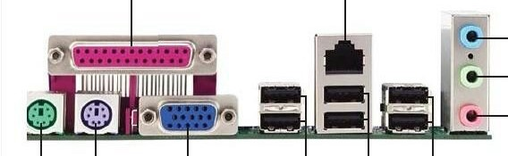
 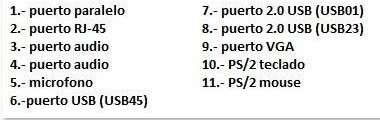
 
  

PARTE 2

 

DE ACUERDO A LAS IMAGENES QUE SE OBSERVAN, DEBAJO DE CADA UNA ESCRIBE SU NOMBRE Y CON UNA PALOMITA O TACHA PONLO EN EL PEREFERICO QUE TU CONSIDERES

<table width="60%" border="20" cell padding="0" cellspacing="30" width="75%" bgcolor="FFFFFF" bordercolor "black">
<tr>
<td> 
 TIPO DE PEREFERICO </td>
<td>
  ENTRADA</td>
<td> 
 SALIDA </td>
<td> 
 ALMACENAMIENTO </td>
</tr>

<tr>
<td></td>
<td> -</td>
<td>  - </td>
<td>  - </td>
</tr>

<tr>
<td>   </td>
<td>  -</td>
<td>  - </td>
<td>  - </td>
</tr>

<tr>
<td>   </td>
<td>  -</td>
<td>  - </td>
<td>  - </td>
</tr>

<tr>
<td>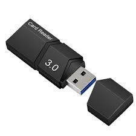   </td>
<td>  -</td>
<td>  - </td>
<td>  - </td>
</tr>

<tr>
<td>   </td>
<td>  -</td>
<td>  - </td>
<td>  - </td>
</tr>

<tr>
<td>   </td>
<td>  -</td>
<td>  - </td>
<td>  - </td>
</tr>

<tr>
<td>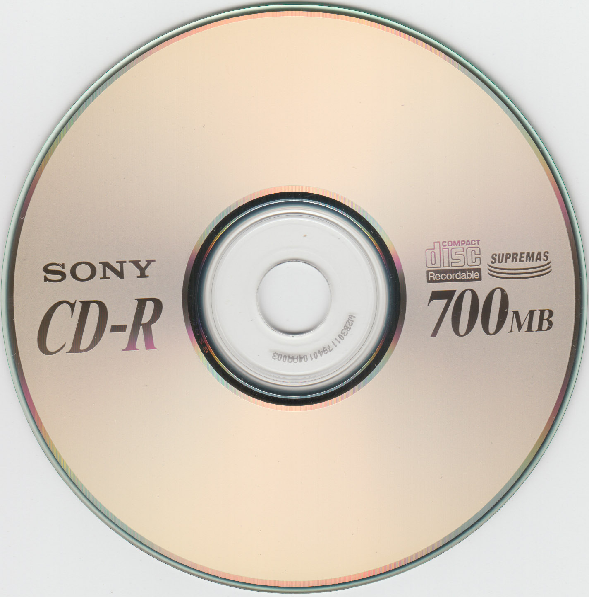   </td>
<td>  -</td>
<td>  - </td>
<td>  - </td>
</tr>

<tr>
<td>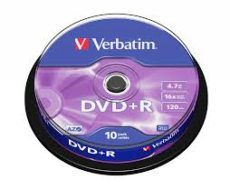   </td>
<td>  -</td>
<td>  - </td>
<td>  - </td>
</tr>

<tr>
<td>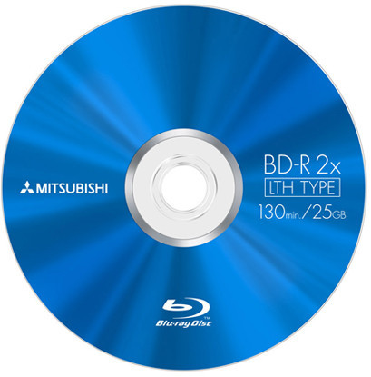   </td>
<td>  -</td>
<td>  - </td>
<td>  - </td>
</tr>

<tr>
<td>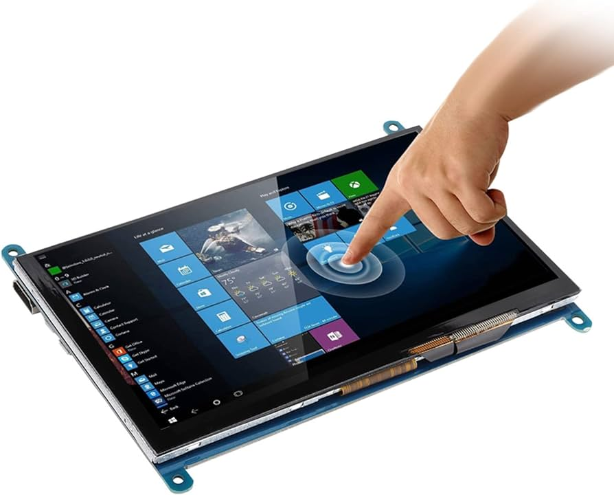   </td>
<td>  -</td>
<td>  - </td>
<td>  - </td>
</tr>

<tr>
<td>   </td>
<td>  -</td>
<td>  - </td>
<td>  - </td>
</tr>

<tr>
<td>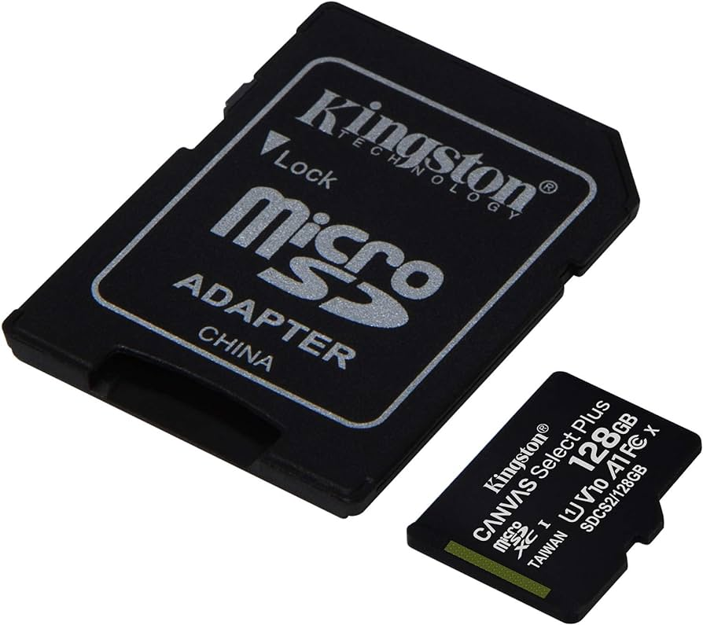   </td>
<td>  -</td>
<td>  - </td>
<td>  - </td>
</tr>

<tr>
<td>   </td>
<td>  -</td>
<td>  - </td>
<td>  - </td>
</tr>

<tr>
<td>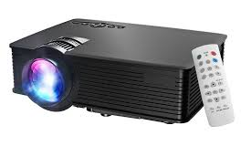   </td>
<td>  -</td>
<td>  - </td>
<td>  - </td>
</tr>

<tr>
<td>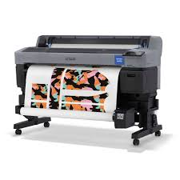   </td>
<td>  -</td>
<td>  - </td>
<td>  - </td>
</tr>

<tr>
<td>   </td>
<td>  -</td>
<td>  - </td>
<td>  - </td>
</tr>

<tr>
<td>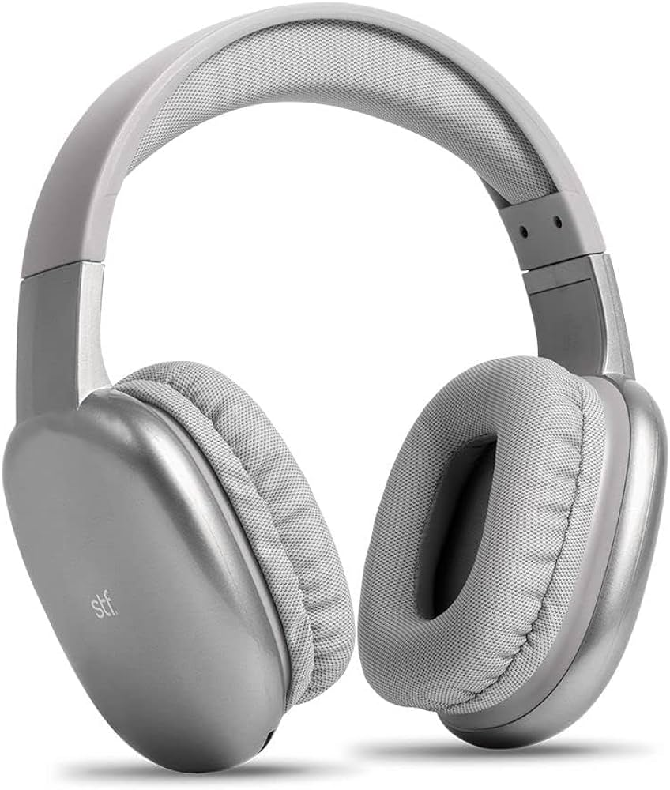   </td>
<td>  -</td>
<td>  - </td>
<td>  - </td>
</tr>

<tr>
<td>   </td>
<td>  -</td>
<td>  - </td>
<td>  - </td>
</tr>

<tr>
<td>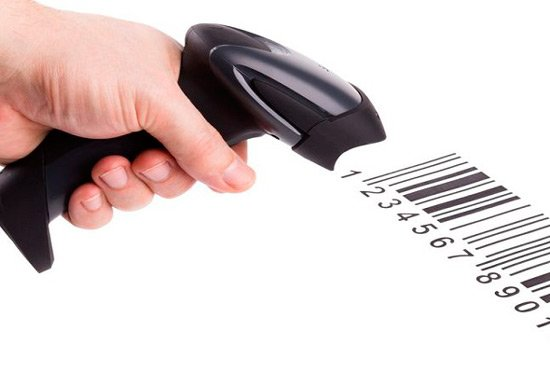   </td>
<td>  -</td>
<td>  - </td>
<td>  - </td>
</tr>

<tr>
<td>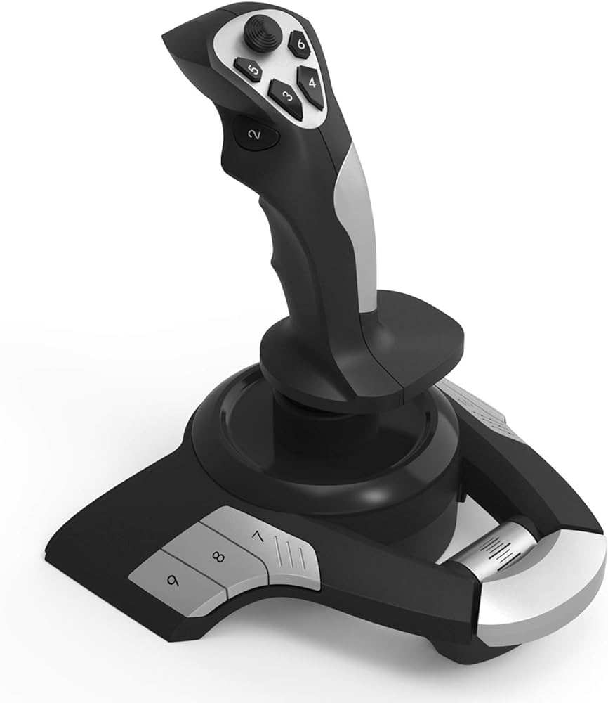   </td>
<td>  -</td>
<td>  - </td>
<td>  - </td>
</tr>

<tr>
<td>   </td>
<td>  -</td>
<td>  - </td>
<td>  - </td>
</tr>

<tr>
<td>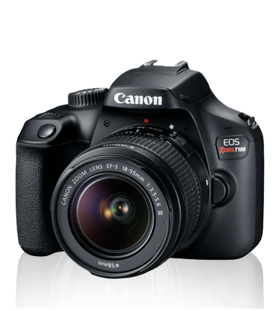   </td>
<td>  -</td>
<td>  - </td>
<td>  - </td>
</tr>

<tr>
<td>   </td>
<td>  -</td>
<td>  - </td>
<td>  - </td>
</tr>

<tr>
<td>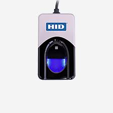   </td>
<td>  -</td>
<td>  - </td>
<td>  - </td>
</tr>
</table>

   
 

ACTIVIDAD 6
 

DISPOSITIVOS PERIFERICOS

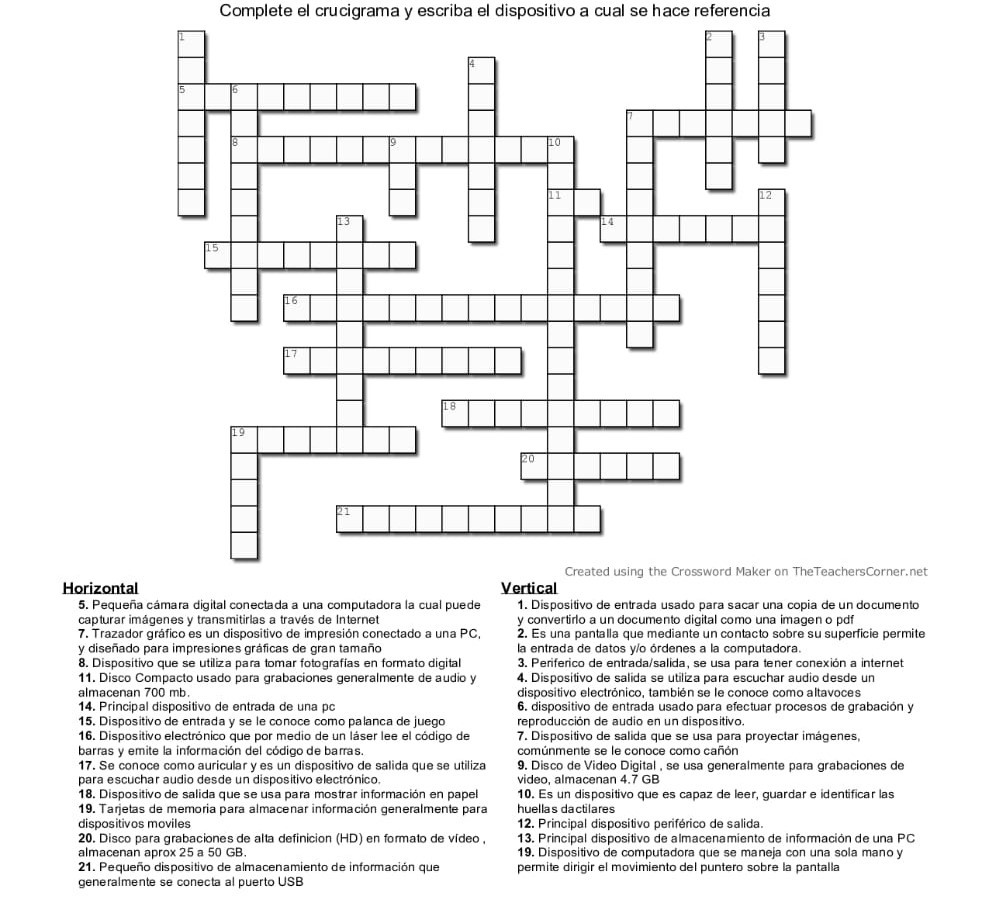

  
 

ACTIVIDAD 7

UNIDADES DE ALMACENAMIENTO DE INFORMACION

 

1-¿Cómo representa la computadra las datos  las procesos y su informacion?

  

2.¿Como se llama el codigo que usa la pc para representar letras,numeros y simbolos especiales? 

  

3.¿En la informatica cada letra, numero o signo de puntuacion a cuanto equivale? 

  

4.¿Que es un bit? 

  

5.¿A cuanto equivale un bit? 

  

6.¿Cuantas combinaciones con 8 bits se obtienen con los bits? 

  

7.¿Cuantas combinaciones con 8 bits se obtienen con los bits? 

  

8.¿Como se llama cada(letra,numero o simbolo)que se introduce en una computadora? 

  

¿Ques es el codigo binario? 

  

¿Cuales son los simbolos que se utilizan en el codigo binario? 

  

¿Con que se representa cada letra,numero o signo de puntuacion? 

  

¿Cual es la unidad de memoria obtenida del sistema binario y representa por 0 o 1  ? 

  

¿Como se denomina a la unidad de memoria que equivale a 8 bits consecutivos ? 

  

¿Cuantas combinaciones posibles se pueden lograr con las 8 ceros y unos que forman un byte? 

  

¿Cuando bytes (carecteres , letras o numeros)se pueden almacenar en un CD de 650 mb? 

  

¿Cuantos bytes de capacidad tiene una memoria de 8 gb? 

  

¿Cual es la capacidad de almacenamiento de un dvd? 

  

¿Calcular cuantos bytes ocupa un documento que tiene 69 kb ? 

  

¿Cuantos bits son 68 bytes ? 

  

¿Cuantos bits son 512 bytes ? 

  

¿Cuantos mb sob 3 gb ? 

  

¿Cuantos gb son 4096 ? 

  

¿Cuantos canciones entran en una memoria de 16 gb si aproximadamente una cancion ocupa 5m de almacenamiento ? 

 

PARTE 2

 

NOMBRE:         GRUPO:

 

Completa la siguiente tabla que muestra la relacion entre las distintas unidades de almacenamiento que usan computadoras.Los calculos binarios se basan en unidades de 1024

<table width="60%" border="10" cell padding="0" cellspacing="10"width="75%" bgcolor="pink"  bordercolor "blue">
<tr>
<td>  NOMBRE </td>
<td>  MEDIDA BINARIA </td>
<td>  SIMBOLOGIA </td>
<td>  EQUIVALENCIA  </td>
<td> CANTIDAD DE BITS </td>
</tr>
<tr>
<td>  BYTE </td>
<td> 2/8  </td>
<td>  B </td>
<td>  8 BITS  </td>
<td> 1 BYTE </td>
</tr>
<tr>
<td>  KILOBYTE </td>
<td>  2/10 </td>
<td>  KB </td>
<td>  1024KB </td>
<td>  1024 BYTES</td>
</tr>
<tr>
<td>  MEGABYTE</td>
<td>  2/20 </td>
<td>  MB </td>
<td>  1024KB  </td>
<td>  1048576 BYTES</td>
</tr>
<tr>
<td>  GIGABYTE </td>
<td> 2/30 </td>
<td>   </td>
<td>   </td>
<td>  </td>
</tr>
<tr>
<td>  TERABYTE</td>
<td>  2/40 </td>
<td>  </td>
<td>    </td>
<td> </td>
</tr>
<tr>
<td>  PETABYTE </td>
<td> 2/50 </td>
<td>   </td>
<td>    </td>
<td>  </td>
</tr>
<tr>
<td>  EXABYTE </td>
<td>  2/60 </td>
<td>   </td>
<td>    </td>
<td>  </td>
</tr>
<tr>
<td>  ZETABYTE </td>
<td> 2/70</td>
<td>  </td>
<td>    </td>
<td>  </td>
</tr>
<tr>
<td>  YOTTABYTE </td>
<td>  2/80 </td>
<td>   </td>
<td>    </td>
<td>  </td>
</tr>
<tr>
<td>  BRONCOTOBYTE </td>
<td>  2/90 </td>
<td>  </td>
<td>  </td>
<td>  </td>
</tr>
<tr>
<td>  GEOPBYTE</td>
<td>  2/100 </td>
<td>  </td>
<td>    </td>
<td>  </td>
</tr>

</table>

 

ACTIVIDAD 8. CONVERSIONES

 

HAZ LA CONVERSION DEPENDIENDO DE QUE UNIDAD ES

 

¿Cuantos mb son 1 gb ?

 

¿Cuantos bits son 1 mb ?

 

¿Cuantos mb son 1000000 bytes? 

 

¿Cuantos mb son 10254 bytes ?

 

¿Y 10253, 2048 bytes ?

 

9.Suponiendo que tenemos 15 archivos que ocupan 1210 bytes cada uno y , ademas,otros 12 archivos que ocupan 23420 KB cada uno;     A)¿Cuando espacio libre (en MB) quedara en un pendrive en el que guardo todos estan archivo si dicho pendrive tiene una capacidad de 521 MB?    ¿Cuando archivos de tamaño 20200 bits cabrian en dicho espacio libre ?

   
 

ACTIVIDAD 9

COMPLETA LA TABLA 

<table width="100%" border="1" cell padding="0" cellspacing="1"width="75%" bgcolor="pink" bordercolor="black">
<tr>
<td>  PROCESADOR  </td>
<td>  VENTAJAS </td>
<td>  DESVENTAJAS  </td>
<td>  MODELOS  </td>
</tr>

<tr>
<td> 
<H1> RYZEN
 </td>
<td>                             </td>
<td>                            </td>
<td>                            </td>
</tr>

<tr>

</table>
  
<table width="100%" border="1" cellpadding="0" cellspacing="1"width="75%" bgcolor="yellow" bordercolor="black">
<tr>
<td>  PROCESADOR  </td>
<td>  VENTAJAS </td>
<td>  DESVENTAJAS  </td>
<td>  MODELOS  </td>
</tr>
<tr>
<td> 
<H1>INTEL
  </td>
<td>                             </td>
<td>                             </td>
<td>                           </td>
</tr>
</table>
 
 

ACTIVIDAD 10

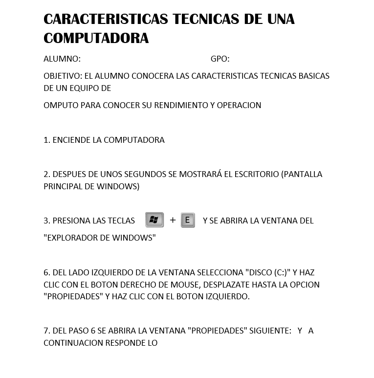
 
 
 
 

ACTIVIDAD 11

HAZ UNA INVESTIGACION SOBRE EL USO  DEL TECLADO ,ZONAS BASICAS DEL TECLADO HABLAR DE ELLAS Y PARA QUE SIRVEN,ESTAS TECLAS QUE SE MOSTRARAN ACONTINUACION CUAL ES SU FUNCION   

 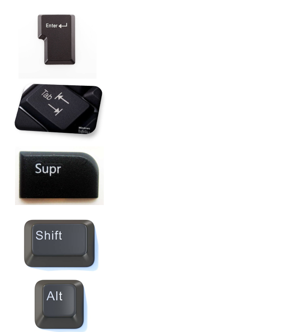
 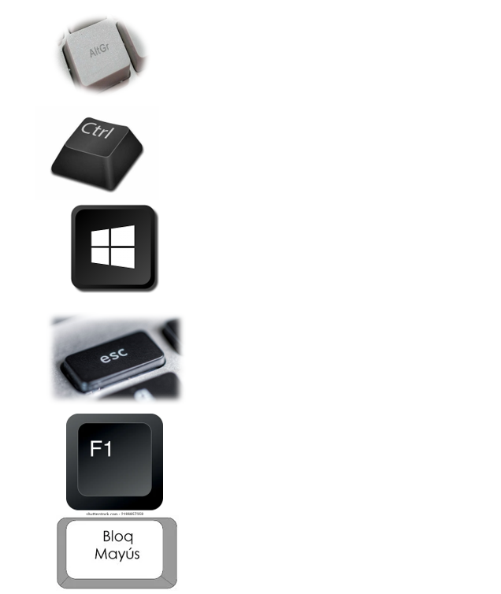
 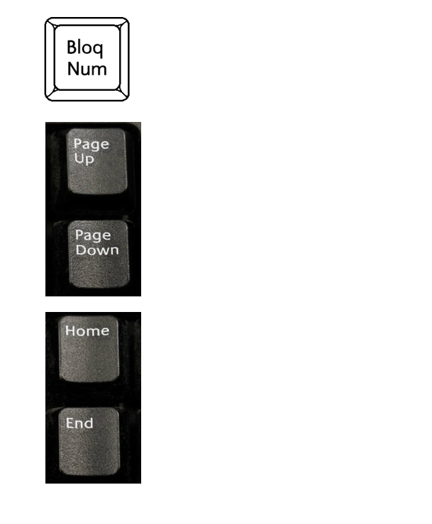
 
 

ACTIVIDAD 12

REALIZA UN MAPA MENTAL SOBRE LAS PARTES DE UNA COMPUTADORA(DIGITAL)   
 
  
 
 
 

PARCIAL 2

ACTIVIDAD 1   

 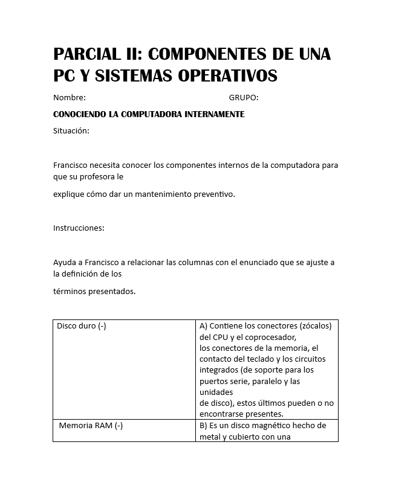
 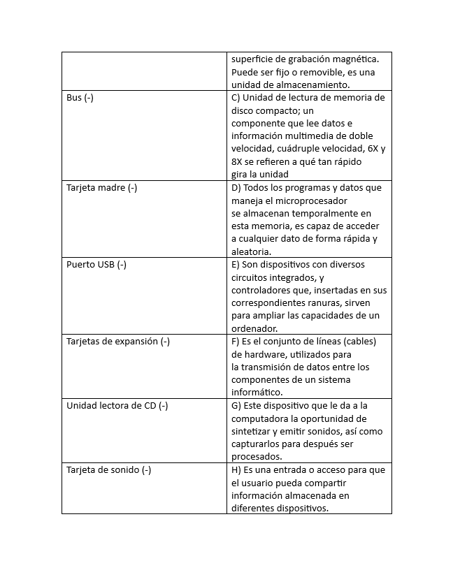
 
 

ACTIVIDAD 2   

REALIZA UNA LINEA DEL TIEMPO EN TU LIBRETA SOBRE LA EVOLUCION DE WINDOWS (1985-2021)  

 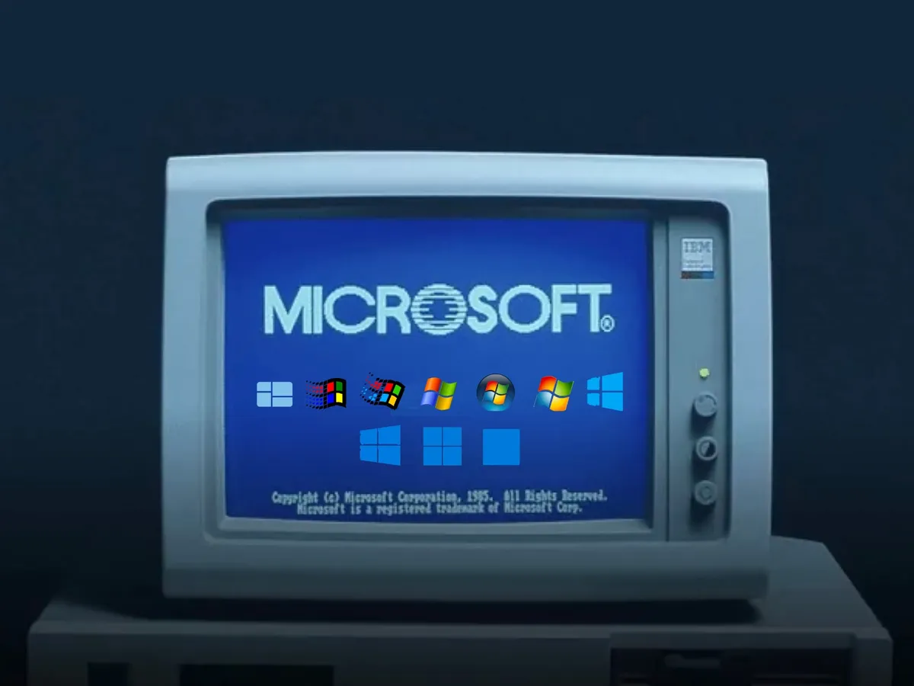
   

ACTIVIDAD 3   

DE ACUERDO A LA IMAGEN DEFINE CUAL ES LA  

FUNCION DE CADA COMPONENTE Y PEGA LA IMAGEN EN TU LIBRETA    

 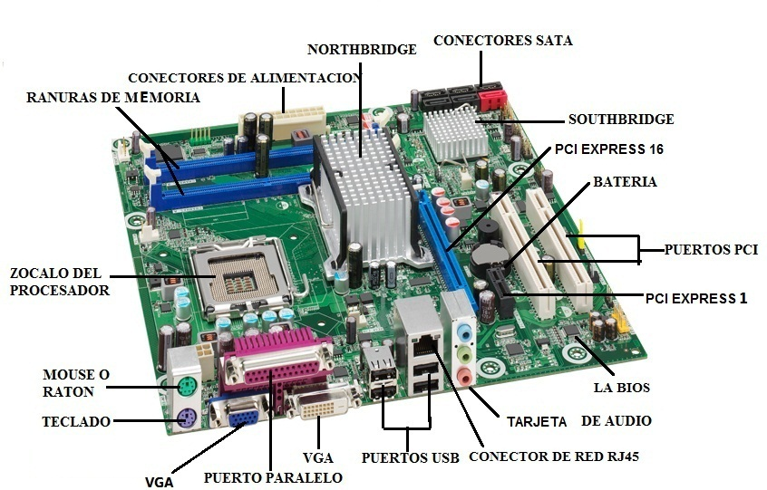
   

ACTIVIDAD 4 (CUESTIONARIO DE WINDOWS)

COPIA LAS PREGUNTAS EN TU CUADERNO Y CONTESTA   

1.¿A qué se denomina menú en Windows?  

2. ¿Qué funciones desempeña el Explorador de Windows?  

3. Para eliminar un archivo en Windows, debemos hacer  

4. El "panel de control" es sirve para:  

5. ¿Cómo se denomina en Windows al gráfico con un subtítulo que representa otrasventanas o programas?  

6. ¿Cuál es la pantalla principal de Windows?  

7. ¿Qué es un icono?  

8. ¿Cuál es la función de la papelera de reciclaje?  

9. Los botones de Cerrar, Minimizar, Restaurar, en conjunto ¿Cómo se les llama?  

10. Pasos para crear una carpeta  

11. ¿Cuál es la diferencia entre un cuadro de diálogo y una ventana?  

12. Que es Restaurar una ventana:  

13. Que es maximizar una ventana:  

14: que es minimizar una ventana  

15.	¿Cómo cambiar el nombre de un archivo?  

16.	Cómo recuperar un archivo de la Papelera de Reciclaje  

17.	Que elementos tiene la barra de tareas de Windows  

18.	Que elementos tiene el área de notificación  

19.	Para que sirve la combinación win + r   

20.	Donde coloco el puntero del mouse para mover una ventana que no esta maximizada  

21.	Para que se hace doble clic con el mouse  

22.	Cuando aplico la acción arrastrar con el mouse  

23.	Que pasa si hago doble clic sobre la barra de titulo independientemente en que modo esta la ventana  

24.	Cuál es la función del explorador de Windows  

25.	Con que combinación de teclas se abre el explorador de Windows  

26.	Que es un archivo en Windows  

27.	Para que sirve la extensión de un archivo  

28.	Mencióna 5 extensiones de archivos y el tipo de archivo que representa (ejemplo: mp3 es audio)  

29.	Para que sirve la aplicación “administrador de tareas”  

30.	Como activo de administrador de tareas de Windows  

  
  

ACTIVIDAD 5 (CUESTIONARIO ADMINISTRADOR DE TAREAS)

 COPIA LAS PREGUNTAS EN TU LIBRETA Y CONTESTA LO SIGUIENTE 

¿Que es el administrador de tareas ?  
¿Como entrar al administrar de tareas?   
¿Que informacion nos proporciona el administrador de tareas?     

  

ACTIVIDAD 6 (MANUAL DE WINDOWS 11 EN WORD)

 HAZ UNA MANUAL SOBRE WINDOWS 11 UTILIZANDO HIPERVINCULOS 

 CONTENIDO 

 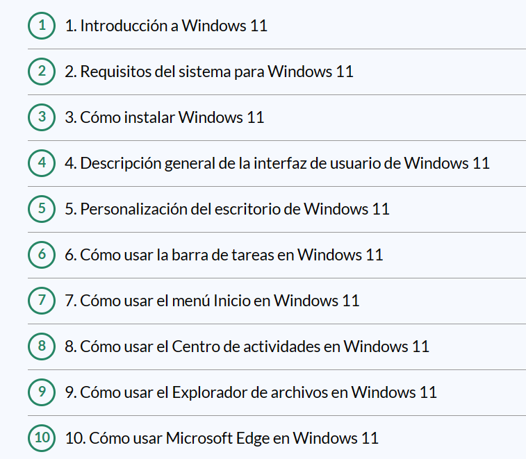
 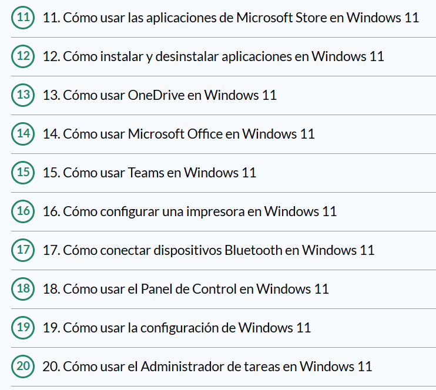
 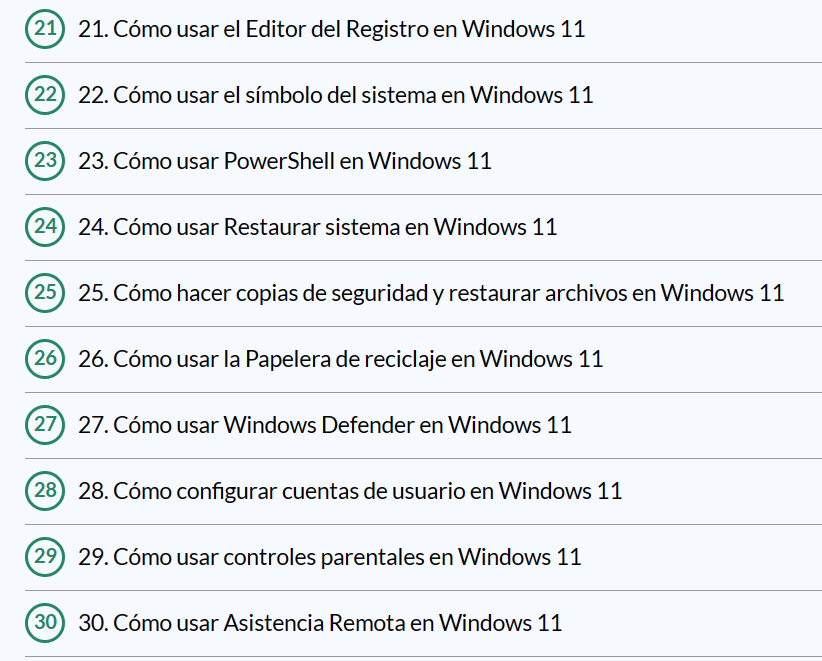
 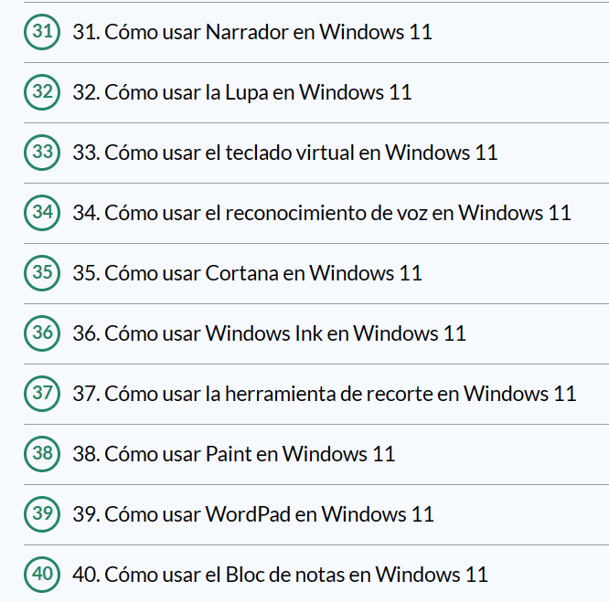
 

  

ACTIVIDAD 7 (ERGONOMIA EN EL USO DE UNA PC)

REALIZA UNA INFOGRAFIA SOBRE EL TEMA SELECIONADO EN DONDE HABLES SOBRE QUE ES , COMO PREVENIRLO Y SUS CONSECUENCIAS. 

 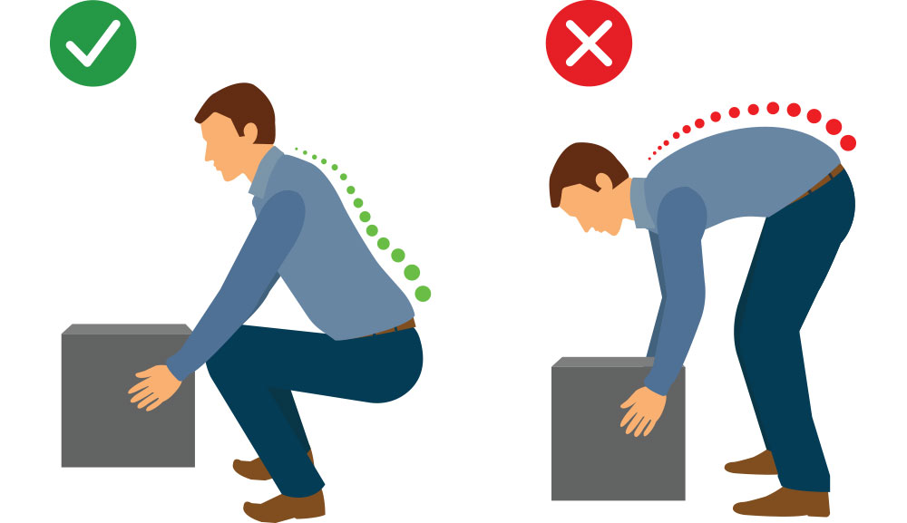

  

ACTIVIDAD 8 (MANTENIMIENTO DE UNA PC)

INVESTIGA SOBRE EL MATENIMIENTO DE COMPUTADORAS,
 PREVENTIVO.

 HACER MANUALES DE MANTENIMIENTO
 DEL TECLADO Y MOUSE , QUE ES LA ERGONOMIA. 

UNA TABLA SOBRE DISPOSITIVOS(TECLADO,MOUSE,MONITOR,FUENTE DE ALIMENTACION 
 Y GABINETE CON SUS PROBLEMAS Y SOLUCION.

</body>
</html>
